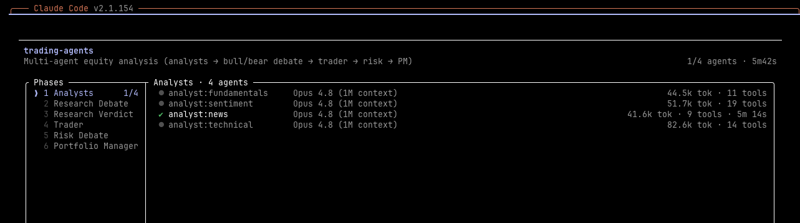

<h1 align="center">Awesome Claude Workflows</h1>

<p align="center">
  <a href="https://awesome.re"></a>
  <a href="https://makeapullrequest.com"></a>
  <a href="LICENSE"></a>
</p>

<p align="center">
A community-curated directory of real, production-tested <b>Claude Code dynamic workflows</b> —
large-scale, multi-agent pipelines you can install and run in one command.
</p>

---

## The showcase: Trading Agents

The clearest way to explain what this repo collects is to show one. **[Trading Agents](workflows/trading-agents/)**
turns a single ticker into a rated, risk-checked decision by mirroring how a real trading firm works —
**four analysts in parallel → a bull/bear research debate → a trader → a three-way risk debate → a
portfolio manager's final 5-tier rating**, then exports a Markdown report and a self-contained HTML page.



A single run fans out **15+ agents** that gather live data, argue opposing cases, and adversarially
check each other before anything is reported — in the [committed sample run](workflows/trading-agents/sample-run-nvda-2026-05-28.json)
the verification stages flipped a naive "bullish" read into a disciplined **Hold** by refusing to act on
numbers they couldn't confirm. That is the bar for what belongs here. *(Research only — not financial advice.)*

## Built on Claude Code dynamic workflows

[Dynamic workflows](https://code.claude.com/docs/en/workflows) launched **May 28, 2026** (with Claude
Opus 4.8). Instead of working a task turn by turn, Claude writes a **JavaScript orchestration script**
that a runtime runs in the background — fanning out **tens to hundreds of parallel subagents** (up to
1,000 per run), checking their work, and returning one coordinated answer while your session stays free.

Trading Agents is built on this feature because its problem *is* an orchestration problem, and workflows
solve exactly the parts that break down when you try to do it with a single agent or ad-hoc subagents:

- **Coordination at scale** — a dozen-plus roles run in parallel and in sequenced debate rounds; one
  conversation can't hold or coordinate that.
- **The plan lives in code** — the loop, the branching, and every intermediate result sit in the script,
  so it's *repeatable* and the chat context only carries the final decision (no context blow-up).
- **Structured hand-offs** — each role returns a validated, typed object the next stage consumes, instead
  of brittle free-text passing.
- **Built-in verification** — independent agents adversarially review findings before they're trusted,
  which is what makes the result more reliable than a single pass.
- **Deterministic where it matters** — the exported report and page are rendered by fixed code templates,
  so the same run data always produces the same artifact.

## Why this project exists

The feature is days old, and we think it's the start of something big: soon **many people will share
large-scale, agent-to-agent-coordination workflow pipelines** — bug-hunt swarms, migration fleets,
research harnesses, decision desks like Trading Agents. Today there's no shared home for the ones that
actually work.

This open-source project is that home. The goal is simple: **make it easy to contribute a workflow you've
run on a real problem, and easy to find and install the best ones** — so the community compounds its work
instead of everyone reinventing the same pipeline. Add yours; take what's proven.

## Contents

- [Use a workflow](#use-a-workflow)
- [Workflows](#workflows)
  - [Research & Synthesis](#research--synthesis)
  - [Code Review & Quality](#code-review--quality)
  - [Bug Hunts & Audits](#bug-hunts--audits)
  - [Migrations & Modernization](#migrations--modernization)
  - [Design & Planning](#design--planning)
- [Resources](#resources)
- [Contributing](#contributing)
- [License](#license)

## Use a workflow

Claude Code auto-discovers any workflow file dropped into `~/.claude/workflows/` (user scope, every
project) or `./.claude/workflows/` (project scope). Each one becomes a `/<name>` slash command — no
plugin, manifest, or registration needed.

**Install with one command** (installs into `~/.claude/workflows/`):

```bash
# no clone needed — install a single workflow by name
curl -fsSL https://raw.githubusercontent.com/lxcong/awesome-claude-workflows/main/install.sh | bash -s -- trading-agents
```

Or from a clone:

```bash
git clone https://github.com/lxcong/awesome-claude-workflows.git
cd awesome-claude-workflows
./install.sh                  # install all workflows (user scope)
./install.sh trading-agents   # just one
./install.sh --project trading-agents   # into ./.claude/workflows/ instead
```

**Then, in Claude Code:**

```
/trading-agents NVDA as of 2026-05-28
```

or run `/workflows` to browse. (Manual alternative: copy any
`workflows/<name>/<name>.workflow.js` to `~/.claude/workflows/<name>.js` yourself.)

**Prerequisites:** Claude Code **v2.1.154+**, a paid plan, and Dynamic workflows enabled in
`/config`. The first run asks you to approve the plan — pick *"don't ask again"* to skip it next
time. Workflows can use **many tokens**; start scoped.

## Workflows

> 🌱 **This list is just getting started — one workflow so far.** The categories below are the
> scenarios we want to fill. Run a workflow on a real problem? [Add it](#contributing) — that's the
> whole point of this repo.

### Research & Synthesis

- **[Trading Agents](workflows/trading-agents/)** — Multi-agent equity analysis: 4 analysts in
  parallel → bull/bear research debate → trader proposal → aggressive/neutral/conservative risk
  debate → portfolio manager's 5-tier rating. *Patterns: parallel fan-out, sequential debate, judge
  panel. Research only — not financial advice.*

### Code Review & Quality

- 🚧 _To be contributed — [add yours](#contributing)._

### Bug Hunts & Audits

- 🚧 _To be contributed — codebase-wide bug hunts, security audits, dead-code sweeps. [Add yours](#contributing)._

### Migrations & Modernization

- 🚧 _To be contributed — framework swaps, API deprecations, language ports. [Add yours](#contributing)._

### Design & Planning

- 🚧 _To be contributed — plan stress-tests, design judge panels. [Add yours](#contributing)._

## Resources

- [Introducing dynamic workflows in Claude Code](https://claude.com/blog/introducing-dynamic-workflows-in-claude-code) — official launch post (May 28, 2026)
- [Dynamic workflows documentation](https://code.claude.com/docs/en/workflows) — official docs
- [Dynamic Workflows in Claude Code — Hacker News](https://news.ycombinator.com/item?id=48311705)
- [r/ClaudeCode: Multi-agent workflows](https://www.reddit.com/r/ClaudeCode/comments/1qlf38z/multiagent_workflows_aka_multiclauding/)

## Contributing

**This repo lives on your contributions.** If you've built a workflow that solved a real problem,
share it so others can learn from a working example.

See [CONTRIBUTING.md](CONTRIBUTING.md). In short — add one entry to the right use-case section:

```markdown
- [Name](link) — One-line description of the problem it solves. *By [@you](https://github.com/you)*
```

Prefer workflows you've actually run, and note the rough token cost / plan if you can.

## License

[MIT](LICENSE) © 2026 lxcong and contributors. Curated entries remain under their respective owners'
licenses.
